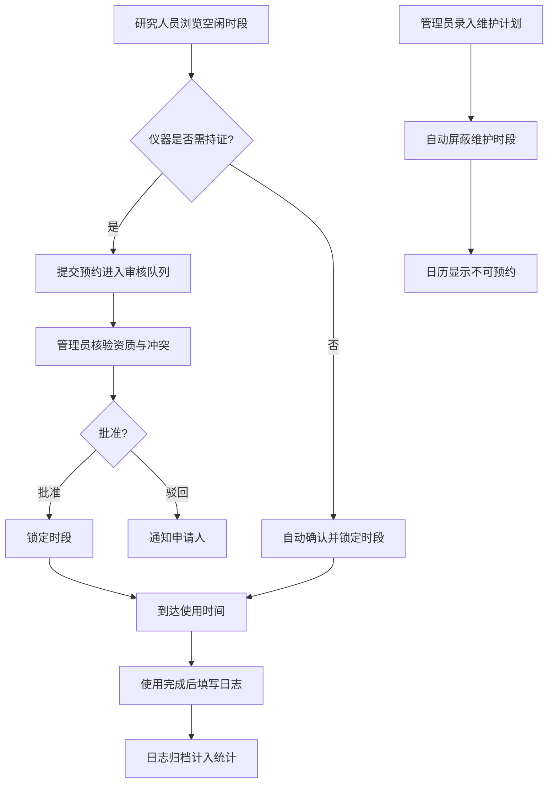

# 实验室仪器设备预约管理系统 — 产品需求文档（PRD）

## 1. 产品概述

实验室仪器设备预约管理系统是一款面向科研机构的共享仪器时间分配平台，区别于样品追踪，专注于解决“多课题组共用昂贵仪器”的时段冲突、资质合规与维护排程问题。
- 目标用户：研究人员（申请人）、仪器管理员（审核与维护排程）、实验室主管（采购决策与统计）。
- 核心价值：让高价值仪器的使用时段可视化、资质可认证、维护可屏蔽、利用率可度量，辅助新仪器采购决策。

## 2. 核心功能

### 2.1 用户角色

| 角色 | 注册/授权方式 | 核心权限 |
|------|---------------|----------|
| 研究人员 | 系统分配账号 | 浏览仪器与空闲时段、提交预约申请、填写使用日志、查看本人统计 |
| 仪器管理员 | 主管指派 | 维护仪器信息与维护计划、审核资质预约、查看所辖仪器统计 |
| 实验室主管 | 系统最高权限 | 管理资质认证、查看全局统计、新仪器采购决策看板 |

### 2.2 功能模块

1. **仪表盘**：关键指标、今日预约时间线、待审核提醒、仪器状态总览、使用率概览。
2. **仪器管理**：仪器卡片列表与详情（型号、手册、操作要求、资质要求开关、维护状态）。
3. **预约中心**：跨仪器日历视图、空闲时段查询、提交预约申请（实验用途、时长、申请人/课题组）。
4. **我的预约**：个人预约列表与状态跟踪、取消/改期。
5. **审核中心**（管理员）：待审核预约队列、资质核验、批准/驳回后锁定时段。
6. **使用日志**：使用完成后填写日志（实际时长、仪器状态、异常情况）、历史日志查阅。
7. **维护计划**：维护保养计划录入与排程，维护期间自动屏蔽预约、冲突检测。
8. **资质管理**（主管）：资质项目定义、人员资质认证与有效期、资质模板。
9. **统计分析**：各仪器使用率、课题组使用时长占比、高峰使用时段、采购决策辅助。

### 2.3 页面详情

| 页面名称 | 模块名称 | 功能描述 |
|----------|----------|----------|
| 仪表盘 | 关键指标 | 在用仪器数、今日预约数、待审核数、本月使用总时长；使用率趋势 |
| 仪表盘 | 今日时间线 | 按时段展示今日所有预约的甘特时间线 |
| 仪表盘 | 待办提醒 | 待审核预约、待填写日志、即将到来的维护 |
| 仪器列表 | 仪器卡片 | 型号、状态徽标、资质要求、当前占用、利用率，筛选与搜索 |
| 仪器详情 | 信息区 | 型号/编号/手册/操作要求/资质要求/维护窗口 |
| 仪器详情 | 日历区 | 该仪器本周空闲时段日历，可直接发起预约 |
| 预约日历 | 跨仪器视图 | 日/周视图，仪器为行、时段为列，色块表示占用/空闲/维护 |
| 预约申请 | 申请表单 | 选择仪器、时段、填写实验用途、预计时长、附件 |
| 我的预约 | 预约列表 | 按状态分组，查看/取消/查看日志入口 |
| 审核中心 | 审核队列 | 申请人资质比对、时段冲突检测、批准/驳回带备注 |
| 使用日志 | 日志表单 | 实际时长、仪器状态、异常描述、耗材记录 |
| 使用日志 | 日志列表 | 历史日志、按仪器/人员筛选 |
| 维护计划 | 计划日历 | 维护窗口录入、重复规则、自动屏蔽对应时段 |
| 资质管理 | 资质矩阵 | 人员×资质认证状态与有效期、新增认证 |
| 统计分析 | 使用率看板 | 仪器利用率排行、课题组占比环形图、高峰时段热力图 |
| 统计分析 | 采购辅助 | 高负载仪器识别、采购建议优先级排序 |

## 3. 核心流程

### 3.1 预约审核主流程
研究人员在日历上找到空闲时段 → 提交预约申请（填写实验用途与时长）→ 若仪器需持证则进入审核队列 → 仪器管理员核验资质与时段冲突 → 批准则锁定时段，驳回则告知原因 → 使用完成后填写使用日志 → 日志归档并计入统计。

### 3.2 维护屏蔽流程
管理员录入维护计划（起止时间+重复规则）→ 系统自动将该时段标记为维护屏蔽 → 用户日历显示为不可预约 → 已存在的冲突预约触发提醒 → 维护结束后恢复可预约。

## 4. 用户界面设计

### 4.1 设计风格
- **主题方向**：「精密仪器控制台」——深色技术风，像操作高端实验仪器面板，强调刻度感、数据可读性与校准级的精确。
- **主色板**：深石墨背景 `#0B0E13` / 表面 `#131820`；主强调色为示波器荧光青 `#2DD4BF`；次强调色琥珀 `#F59E0B`（维护/待审）；状态色：空闲翡翠绿、占用青蓝、维护琥珀、驳回玫红。
- **按钮**：克制的方角胶囊，主操作荧光青描边发光，次操作幽灵边框，禁用降低饱和。
- **字体**：标题 `Bricolage Grotesque`（带工程感的现代展示体）；正文 `Hanken Grotesk`；数据/读数 `JetBrains Mono`。
- **布局**：左侧固定侧边导航 + 顶部状态栏，主区域 12 列栅格，卡片带细分隔线与刻度细节。
- **图标**：`lucide-react` 线性图标，统一 1.5 描边。

### 4.2 页面设计概览

| 页面名称 | 模块名称 | UI 元素 |
|----------|----------|---------|
| 仪表盘 | 关键指标 | 4 张读数卡（等宽字数字 + 趋势火花线），荧光青高亮 |
| 仪表盘 | 今日时间线 | 横向甘特条，时段刻度，状态色块 |
| 仪表盘 | 待办提醒 | 列表项 hover 抬升 + 左侧状态条 |
| 仪器列表 | 仪器卡片 | 卡片网格，状态徽标，利用率进度环 |
| 仪器详情 | 日历区 | 周视图时段格，空闲/占用/维护三态染色 |
| 预约日历 | 跨仪器视图 | 仪器为行、时段为列的矩阵，可拖选时段 |
| 审核中心 | 审核卡片 | 资质比对标签，时段冲突提示，批准/驳回按钮 |
| 统计分析 | 看板 | 利用率条形排行、占比环形图、高峰热力图 |

### 4.3 响应式
桌面优先（1280px+ 为主），平板自适应折叠侧栏为图标条，移动端将日历矩阵简化为按仪器纵向列表并保留核心操作。触控目标 ≥ 44px。

### 4.4 3D 场景
本项目无 3D 场景需求。
