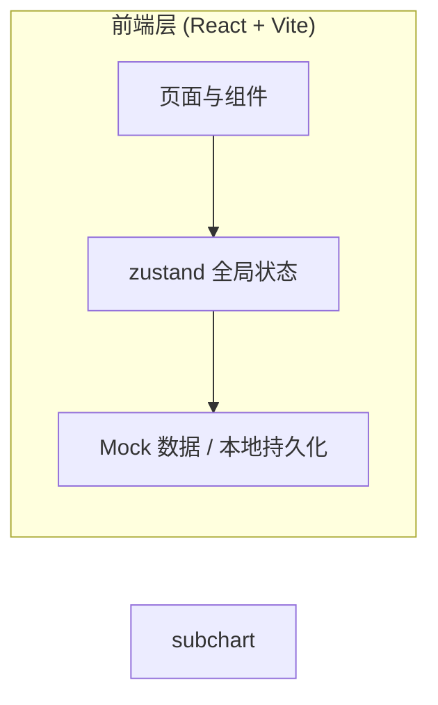
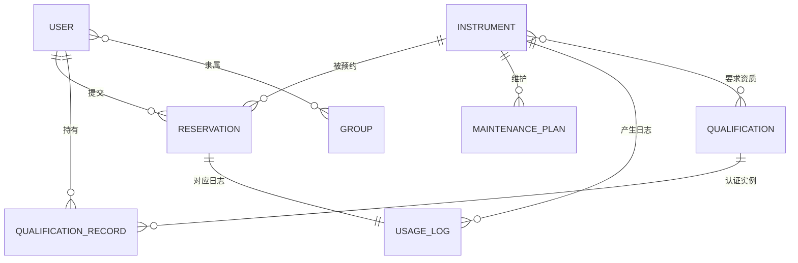

# 实验室仪器设备预约管理系统 — 技术架构文档

## 1. 架构设计

本项目为纯前端单页应用，使用 Mock 数据 + zustand 持久化模拟完整业务闭环，便于演示仪器预约、审核、日志、维护屏蔽与统计全流程。

## 2. 技术说明

- 前端：React@18 + TypeScript + tailwindcss@3 + vite
- 初始化工具：vite-init（react-ts 模板，含 react-router-dom、tailwind、zustand）
- 后端：无（演示用 Mock 数据，localStorage 持久化）
- 数据库：无（前端内存 + localStorage 持久化模拟）

## 3. 路由定义

| 路由 | 用途 |
|------|------|
| `/` | 仪表盘：关键指标、今日时间线、待办提醒 |
| `/instruments` | 仪器列表：卡片网格、筛选搜索 |
| `/instruments/:id` | 仪器详情：信息 + 日历 + 预约入口 |
| `/calendar` | 预约日历：跨仪器日/周视图 |
| `/reservations` | 我的预约：列表与状态跟踪 |
| `/reviews` | 审核中心（管理员）：待审核队列 |
| `/logs` | 使用日志：填写与查阅 |
| `/maintenance` | 维护计划：录入与排程 |
| `/qualifications` | 资质管理：认证矩阵 |
| `/analytics` | 统计分析：使用率/占比/高峰 |

## 4. API 定义

无后端。前端通过 zustand store 提供伪 API（actions），例如：
- `createReservation(payload)`、`approveReservation(id)`、`rejectReservation(id, reason)`
- `submitUsageLog(payload)`、`addMaintenancePlan(payload)`
- `approveQualification(userId, qualificationId)`

## 5. 服务端架构

无后端服务。

## 6. 数据模型

### 6.1 数据模型定义

### 6.2 数据定义

核心实体（TypeScript 接口）：

- **User**：id, name, role(`researcher`|`admin`|`director`), groupId, avatar
- **Group**：id, name（课题组）
- **Instrument**：id, name, model, code, manual, requirements, requiresQualification, qualificationIds[], location, status(`available`|`in_use`|`maintenance`)
- **Qualification**：id, name, description, validityMonths
- **QualificationRecord**：id, userId, qualificationId, grantedAt, expireAt, status
- **Reservation**：id, instrumentId, userId, groupId, start, end, purpose, durationHours, status(`pending`|`approved`|`rejected`|`cancelled`|`completed`), reviewNote, createdAt
- **UsageLog**：id, reservationId, instrumentId, userId, actualDurationHours, instrumentStatus(`normal`|`minor_issue`|`fault`), anomaly, consumables, createdAt
- **MaintenancePlan**：id, instrumentId, title, start, end, rrule, createdAt

初始 Mock 数据覆盖 6 台仪器、3 个课题组、8 名用户、若干预约/日志/维护/资质记录，形成可演示的完整数据闭环。
